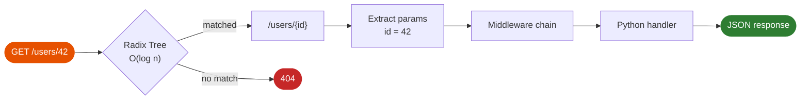

# Routing

Cello uses a high-performance radix tree router implemented in Rust using the `matchit` crate. Routes are compiled at startup for O(log n) lookup performance.

```mermaid
mindmap
  root((Cello Router))
    HTTP Methods
      GET
      POST
      PUT / PATCH
      DELETE
      route() multi-method
    Path Types
      Static   /users
      Param    /users/{id}
      Wildcard /files/{path:*}
    Constraints
      int   {id:int}
      uuid  {id:uuid}
      regex {slug:regex}
    Blueprints
      URL prefix
      Nested blueprints
      Group middleware
```



## Basic Routing

### HTTP Methods

Define routes using method decorators:

```python
from cello import App

app = App()

@app.get("/")
def index(request):
    return {"method": "GET"}

@app.post("/items")
def create_item(request):
    return {"method": "POST"}

@app.put("/items/{id}")
def update_item(request):
    return {"method": "PUT"}

@app.patch("/items/{id}")
def patch_item(request):
    return {"method": "PATCH"}

@app.delete("/items/{id}")
def delete_item(request):
    return {"method": "DELETE"}
```

### Generic Route Method

For custom methods or multiple methods:

```python
@app.route("/resource", methods=["GET", "POST"])
def resource(request):
    if request.method == "GET":
        return {"action": "list"}
    else:
        return {"action": "create"}
```

## Path Parameters

Capture dynamic URL segments:

### Basic Parameters

```python
@app.get("/users/{id}")
def get_user(request):
    user_id = request.params["id"]
    return {"id": user_id}

@app.get("/users/{user_id}/posts/{post_id}")
def get_user_post(request):
    return {
        "user_id": request.params["user_id"],
        "post_id": request.params["post_id"]
    }
```

### Wildcard Parameters

Capture remaining path segments:

```python
@app.get("/files/{*path}")
def get_file(request):
    file_path = request.params["path"]
    # path could be "documents/reports/2024/q1.pdf"
    return {"path": file_path}
```

## Query Parameters

Access query string values:

```python
# GET /search?q=python&limit=10&sort=desc
@app.get("/search")
def search(request):
    query = request.query.get("q", "")
    limit = int(request.query.get("limit", "10"))
    sort = request.query.get("sort", "asc")
    return {
        "query": query,
        "limit": limit,
        "sort": sort
    }
```

### Multiple Values

For parameters with multiple values:

```python
# GET /filter?tag=python&tag=rust&tag=web
@app.get("/filter")
def filter_items(request):
    tags = request.query.get_all("tag")  # ["python", "rust", "web"]
    return {"tags": tags}
```

## Route Constraints

Add validation to path parameters:

```python
from cello.routing import IntConstraint, UuidConstraint, RegexConstraint

# Only match integer IDs
@app.get("/users/{id}", constraints={"id": IntConstraint()})
def get_user(request):
    user_id = int(request.params["id"])  # Guaranteed to be valid int
    return {"id": user_id}

# Only match UUIDs
@app.get("/items/{uuid}", constraints={"uuid": UuidConstraint()})
def get_item(request):
    return {"uuid": request.params["uuid"]}

# Custom regex pattern
@app.get("/products/{code}", constraints={"code": RegexConstraint(r"^[A-Z]{3}-\d{4}$")})
def get_product(request):
    return {"code": request.params["code"]}  # e.g., "ABC-1234"
```

### Built-in Constraints

| Constraint | Description | Example |
|------------|-------------|---------|
| `IntConstraint` | Integer values | `/users/123` |
| `UuidConstraint` | UUID v4 format | `/items/550e8400-e29b-41d4-a716-446655440000` |
| `RegexConstraint` | Custom pattern | `/products/ABC-1234` |
| `AlphaConstraint` | Letters only | `/categories/electronics` |
| `AlphanumConstraint` | Letters and numbers | `/codes/ABC123` |

## Blueprints

Organize routes into groups:

### Basic Blueprint

```python
from cello import App, Blueprint

# Create blueprint with prefix
api_v1 = Blueprint("/api/v1")

@api_v1.get("/users")
def list_users(request):
    return {"users": []}

@api_v1.get("/users/{id}")
def get_user(request):
    return {"id": request.params["id"]}

@api_v1.post("/users")
def create_user(request):
    return Response.json(request.json(), status=201)

# Register blueprint
app = App()
app.register_blueprint(api_v1)

# Routes are now:
# GET  /api/v1/users
# GET  /api/v1/users/{id}
# POST /api/v1/users
```

### Nested Blueprints

```python
# User-related routes
users_bp = Blueprint("/users")

@users_bp.get("/")
def list_users(request):
    return {"users": []}

@users_bp.get("/{id}")
def get_user(request):
    return {"id": request.params["id"]}

# API v1 blueprint
api_v1 = Blueprint("/api/v1")
api_v1.register_blueprint(users_bp)

# API v2 blueprint (different implementation)
api_v2 = Blueprint("/api/v2")
# ... different routes

# Main app
app = App()
app.register_blueprint(api_v1)
app.register_blueprint(api_v2)

# Routes:
# GET /api/v1/users
# GET /api/v1/users/{id}
```

### Blueprint Middleware

Apply middleware to all blueprint routes:

```python
from cello import Blueprint
from cello.middleware import JwtAuth

admin_bp = Blueprint("/admin")

# Apply auth to all admin routes
admin_bp.use(JwtAuth(config))

@admin_bp.get("/dashboard")
def admin_dashboard(request):
    return {"admin": True}
```

## API Versioning

Multiple versioning strategies:

### URL Path Versioning

```python
api_v1 = Blueprint("/api/v1")
api_v2 = Blueprint("/api/v2")

@api_v1.get("/users")
def users_v1(request):
    return {"version": 1, "users": [...]}

@api_v2.get("/users")
def users_v2(request):
    return {"version": 2, "data": {"users": [...]}}

app.register_blueprint(api_v1)
app.register_blueprint(api_v2)
```

### Header-Based Versioning

```python
@app.get("/users")
def get_users(request):
    version = request.get_header("API-Version", "1")
    if version == "2":
        return {"version": 2, "data": {...}}
    return {"version": 1, "users": [...]}
```

## Route Priority

Routes are matched in order of specificity:

1. Exact matches first
2. Parameterized routes second
3. Wildcard routes last

```python
@app.get("/users/me")           # Matched first for /users/me
def get_current_user(request):
    return {"user": "current"}

@app.get("/users/{id}")          # Matched for /users/123
def get_user(request):
    return {"id": request.params["id"]}

@app.get("/users/{*path}")       # Matched for /users/123/posts/456
def user_wildcard(request):
    return {"path": request.params["path"]}
```

## Performance

Cello's routing performance:

| Operation | Time | Notes |
|-----------|------|-------|
| Route lookup | ~100ns | Radix tree O(log n) |
| Parameter extraction | ~50ns | Zero-copy |
| Constraint validation | ~100ns | Pre-compiled regex |

!!! tip "Route Optimization"
    - Use path parameters instead of query parameters for better caching
    - Place more specific routes before generic ones
    - Use constraints to fail fast on invalid parameters

## Next Steps

- [Request Handling](requests.md) - Working with request data
- [Response Types](responses.md) - Different response formats
- [Blueprints](blueprints.md) - Advanced blueprint usage
