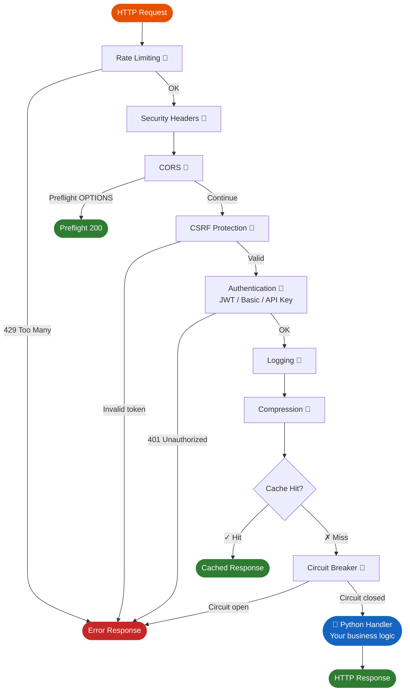

# Middleware Overview

Cello's middleware system is implemented entirely in Rust as an async chain. Each incoming request passes through the middleware stack before reaching your handler, and the response passes back through in reverse order. Because the middleware runs in Rust, there is virtually zero Python overhead per request.

## How Middleware Works



Each middleware can:

- **Continue** -- pass the request to the next middleware in the chain.
- **Stop** -- short-circuit and return a response immediately (e.g., rate limit exceeded).
- **Error** -- return an error response.

---

## Built-in Middleware

| Middleware | Enable Method | Description | Version |
|-----------|---------------|-------------|---------|
| **CORS** | `app.enable_cors()` | Cross-Origin Resource Sharing | v0.2.0 |
| **Logging** | `app.enable_logging()` | Request/response logging | v0.2.0 |
| **Compression** | `app.enable_compression()` | Gzip response compression | v0.2.0 |
| **Rate Limiting** | `app.enable_rate_limit()` | Token bucket / sliding window | v0.4.0 |
| **JWT Auth** | `app.use(JwtAuth(...))` | JSON Web Token authentication | v0.4.0 |
| **Basic Auth** | `app.use(BasicAuth(...))` | HTTP Basic authentication | v0.4.0 |
| **API Key Auth** | `app.use(ApiKeyAuth(...))` | API key header validation | v0.4.0 |
| **Sessions** | `app.enable_sessions()` | Secure cookie sessions | v0.4.0 |
| **CSRF** | `app.enable_csrf()` | Cross-Site Request Forgery protection | v0.4.0 |
| **Security Headers** | `app.enable_security_headers()` | CSP, HSTS, X-Frame-Options | v0.4.0 |
| **Body Limit** | automatic | Request size validation | v0.4.0 |
| **Request ID** | automatic | UUID-based request tracing | v0.4.0 |
| **ETag** | automatic | Conditional request support | v0.4.0 |
| **Static Files** | `app.enable_static_files()` | Static file serving | v0.4.0 |
| **Prometheus** | `app.enable_prometheus()` | Metrics collection | v0.5.0 |
| **Caching** | `app.enable_caching()` | Smart caching with TTL | v0.6.0 |
| **Circuit Breaker** | `app.enable_circuit_breaker()` | Fault tolerance | v0.6.0 |

---

## Enabling Middleware

### Zero-Configuration Defaults

Most middleware works with sensible defaults:

```python
from cello import App

app = App()

app.enable_cors()           # Allow all origins
app.enable_logging()        # Log requests to stdout
app.enable_compression()    # Gzip responses > 1KB
```

### Customized Configuration

Every middleware accepts configuration parameters:

```python
from cello import App, RateLimitConfig, SessionConfig

app = App()

# CORS with specific origins
app.enable_cors(origins=["https://example.com", "https://app.example.com"])

# Compression with custom minimum size
app.enable_compression(min_size=512)

# Rate limiting with token bucket algorithm
app.enable_rate_limit(RateLimitConfig.token_bucket(
    requests=100,
    window=60
))

# Sessions with full configuration
app.enable_sessions(SessionConfig(
    secret=b"session-secret-minimum-32-bytes-long",
    max_age=86400
))
```

---

## Middleware Ordering

Middleware runs in the order it is registered. The recommended order is:

1. **Rate Limiting** -- reject abusive requests early
2. **Security Headers** -- always set headers
3. **CORS** -- handle preflight before auth
4. **CSRF** -- validate tokens before processing
5. **Authentication** -- validate credentials
6. **Logging** -- log after auth (includes user info)
7. **Compression** -- compress at the end
8. **Caching** -- cache final responses

```python
app = App()

# Register in recommended order
app.enable_rate_limit(RateLimitConfig.token_bucket(requests=100, window=60))
app.enable_security_headers()
app.enable_cors()
app.enable_csrf()
app.use(JwtAuth(jwt_config))
app.enable_logging()
app.enable_compression()
app.enable_caching(ttl=300)
```

!!! tip "Order Matters"
    Placing rate limiting first means abusive requests are rejected before any authentication or business logic runs, saving server resources.

---

## Using `app.use()`

For middleware that requires configuration objects (like authentication), use `app.use()`:

```python
from cello.middleware import JwtAuth, JwtConfig, BasicAuth, ApiKeyAuth

# JWT authentication
jwt_config = JwtConfig(secret=b"your-secret-key-minimum-32-bytes-long")
app.use(JwtAuth(jwt_config))

# Basic authentication
app.use(BasicAuth(verify_credentials))

# API Key authentication
app.use(ApiKeyAuth(keys={"key1": "service-a"}, header="X-API-Key"))
```

---

## Async Handler Compatibility

All Python-side middleware wrappers -- including the `@cache` decorator, guard wrappers, and Pydantic validation -- fully support async handlers. Each wrapper uses `inspect.iscoroutinefunction()` to detect async handlers at decoration time and generates the appropriate sync or async wrapper. This means you can freely use `async def` handlers with any combination of caching, guards, and validation without encountering unawaited coroutine issues.

```python
from cello import App, cache, RoleGuard
from pydantic import BaseModel

class Item(BaseModel):
    name: str
    price: float

# Guards + validation + cache all work with async handlers
@app.get("/items", guards=[RoleGuard(["viewer"])])
@cache(ttl=60, tags=["items"])
async def list_items(request):
    return {"items": await db.fetch_all("SELECT * FROM items")}

@app.post("/items", guards=[RoleGuard(["editor"])])
async def create_item(request, item: Item):
    result = await db.insert(item.model_dump())
    return {"id": result["id"]}
```

---

## Middleware Performance

All middleware is implemented in Rust with zero-allocation fast paths:

| Middleware | Overhead per Request | Notes |
|-----------|---------------------|-------|
| CORS | ~50ns | Header checks only |
| Rate Limiting | ~100ns | Lock-free counters |
| JWT Validation | ~50us | Constant-time comparison |
| Security Headers | ~20ns | Static header insertion |
| Compression | ~1us/KB | Native gzip |
| Logging | ~200ns | Async I/O |
| Caching | ~100ns | DashMap lookup |
| Circuit Breaker | ~50ns | Atomic state check |

---

## Next Steps

- [CORS](cors.md) - Cross-Origin Resource Sharing
- [Rate Limiting](rate-limiting.md) - Request throttling
- [Caching](caching.md) - Smart response caching
- [Circuit Breaker](circuit-breaker.md) - Fault tolerance
- [Compression](compression.md) - Response compression
- [Logging](logging.md) - Request logging
