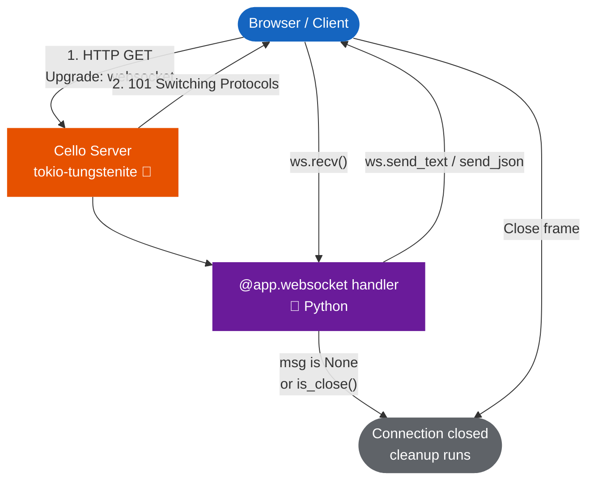

# WebSocket

Cello provides WebSocket support through `tokio-tungstenite`, enabling real-time bidirectional communication between clients and your server. WebSocket handlers are registered with the `@app.websocket()` decorator and receive a `WebSocket` connection object.



---

## Quick Start

```python
from cello import App

app = App()

@app.websocket("/ws")
def echo(ws):
    ws.send_text("Connected!")
    while True:
        msg = ws.recv()
        if msg is None or msg.is_close():
            break
        ws.send_text(f"Echo: {msg.payload}")

if __name__ == "__main__":
    app.run()
```

Test with any WebSocket client:

```javascript
const ws = new WebSocket("ws://localhost:8000/ws");
ws.onmessage = (e) => console.log(e.data);
ws.onopen = () => ws.send("Hello!");
// Output: "Connected!"
// Output: "Echo: Hello!"
```

---

## Async Handlers (recommended)

WebSocket routes are **real connections**: the server answers the RFC 6455
handshake (sha1 `Sec-WebSocket-Accept`), then runs `tokio-tungstenite` with a
tokio channel pair per connection. Use `async def` handlers for production code:

```python
@app.websocket("/ws")
async def echo(ws):
    await ws.accept()
    await ws.send_text("Connected!")
    while True:
        msg = await ws.receive_text()
        if msg is None:
            break
        await ws.send_json({"echo": msg})
```

Async methods: `accept()`, `receive()`, `receive_text()`, `receive_json()`,
`receive_binary()`, plus the synchronous `send_text()` / `send_binary()` /
`send_json()` / `send()` / `recv()` / `close()` helpers. `receive_*` returns
`None` when the peer disconnects.

The sync-style API (from Quick Start above) remains fully supported for simple
or callback-style handlers.

---

## The `@app.websocket()` Decorator

Register a WebSocket endpoint at a given path:

```python
@app.websocket("/ws/chat")
def chat_handler(ws):
    # ws is a WebSocket connection object
    pass
```

The handler function receives a single `ws` argument -- the active WebSocket connection. The handler runs for the duration of the connection; when the function returns, the connection is closed.

---

## The `WebSocket` Object

### Sending Messages

| Method | Description |
|--------|-------------|
| `ws.send_text(text)` | Send a UTF-8 text message |
| `ws.send_binary(data)` | Send binary data as `bytes` |
| `ws.send(message)` | Send a `WebSocketMessage` object |
| `ws.close()` | Close the connection gracefully |

```python
@app.websocket("/ws")
def handler(ws):
    # Send text
    ws.send_text("Hello, client!")

    # Send binary
    ws.send_binary(b"\x00\x01\x02\x03")

    # Send a message object
    msg = WebSocketMessage.text("Structured message")
    ws.send(msg)

    # Close the connection
    ws.close()
```

### Receiving Messages

Call `ws.recv()` to wait for the next message from the client. It returns a `WebSocketMessage` or `None` if the connection is closed:

```python
@app.websocket("/ws")
def handler(ws):
    while True:
        msg = ws.recv()
        if msg is None:
            break  # Client disconnected
        if msg.is_close():
            break  # Client sent close frame
        if msg.is_text():
            print(f"Text: {msg.payload}")
        elif msg.is_binary():
            print(f"Binary: {len(msg.payload)} bytes")
```

### Connection State

| Property | Type | Description |
|----------|------|-------------|
| `ws.connected` | `bool` | Whether the connection is active |

---

## The `WebSocketMessage` Class

Messages are represented by `WebSocketMessage` objects with the following interface:

### Properties

| Property | Type | Description |
|----------|------|-------------|
| `msg_type` | `str` | Message type: `"text"`, `"binary"`, `"ping"`, `"pong"`, or `"close"` |
| `text` | `str | None` | Text content (for text messages) |
| `data` | `bytes | None` | Binary content (for binary messages) |

### Factory Methods

```python
from cello import WebSocketMessage

# Create a text message
msg = WebSocketMessage.text("Hello")

# Create a binary message
msg = WebSocketMessage.binary(b"\x00\x01\x02")

# Create a ping message
msg = WebSocketMessage.ping()

# Create a close message
msg = WebSocketMessage.close()
```

### Type Checking

```python
msg = ws.recv()

if msg.is_text():
    print(f"Text: {msg.payload}")
elif msg.is_binary():
    print(f"Binary: {len(msg.payload)} bytes")
elif msg.is_close():
    print("Client closing connection")
```

---

## Connection Lifecycle

The WebSocket connection follows this lifecycle:

```
1. Client sends HTTP upgrade request
2. Server accepts upgrade (handled by Rust)
3. Handler function is called with active WebSocket
4. Handler sends/receives messages in a loop
5. Handler returns OR client disconnects
6. Connection is closed
```

```python
@app.websocket("/ws/lifecycle")
def lifecycle_demo(ws):
    # Phase: Connected
    ws.send_text("Welcome!")

    # Phase: Message loop
    while True:
        msg = ws.recv()
        if msg is None or msg.is_close():
            break
        ws.send_text(f"Got: {msg.payload}")

    # Phase: Cleanup (connection will close when handler returns)
    print("Client disconnected")
```

---

## Sending JSON

Use `send_text` with `json.dumps` to send structured data:

```python
import json

@app.websocket("/ws/data")
def data_stream(ws):
    ws.send_text(json.dumps({"type": "connected", "status": "ok"}))

    while True:
        msg = ws.recv()
        if msg is None or msg.is_close():
            break

        try:
            data = json.loads(msg.payload)
            response = process_command(data)
            ws.send_text(json.dumps(response))
        except json.JSONDecodeError:
            ws.send_text(json.dumps({"error": "Invalid JSON"}))
```

---

## Chat Room Example

A complete chat application with multiple connected clients:

```python
from cello import App
import json

app = App()

# Store connected clients (in production, use a proper data structure)
clients = []

@app.websocket("/ws/chat")
def chat(ws):
    # Register client
    clients.append(ws)
    ws.send_text(json.dumps({
        "type": "system",
        "message": "Welcome to the chat!",
        "users_online": len(clients),
    }))

    # Broadcast join notification
    broadcast(json.dumps({
        "type": "system",
        "message": "A new user joined",
        "users_online": len(clients),
    }), exclude=ws)

    # Message loop
    while True:
        msg = ws.recv()
        if msg is None or msg.is_close():
            break

        # Broadcast the message to all clients
        broadcast(json.dumps({
            "type": "message",
            "text": msg.payload,
        }))

    # Cleanup on disconnect
    clients.remove(ws)
    broadcast(json.dumps({
        "type": "system",
        "message": "A user left",
        "users_online": len(clients),
    }))

def broadcast(message, exclude=None):
    """Send a message to all connected clients."""
    for client in clients:
        if client is not exclude:
            try:
                client.send_text(message)
            except Exception:
                pass  # Client may have disconnected

if __name__ == "__main__":
    app.run()
```

---

## WebSocket with Path Parameters

WebSocket endpoints support path parameters just like HTTP routes:

```python
@app.websocket("/ws/rooms/{room_id}")
def room_handler(ws, request):
    room_id = request.params["room_id"]
    ws.send_text(f"Joined room: {room_id}")

    while True:
        msg = ws.recv()
        if msg is None or msg.is_close():
            break
        # Broadcast to room members
        ws.send_text(f"[{room_id}] {msg.payload}")
```

---

## Client-Side Example

### JavaScript (Browser)

```javascript
const ws = new WebSocket("ws://localhost:8000/ws/chat");

ws.onopen = () => {
    console.log("Connected");
    ws.send("Hello from browser!");
};

ws.onmessage = (event) => {
    const data = JSON.parse(event.data);
    console.log("Received:", data);
};

ws.onclose = () => {
    console.log("Disconnected");
};

ws.onerror = (error) => {
    console.error("WebSocket error:", error);
};
```

### Python Client

```python
import asyncio
import websockets

async def client():
    async with websockets.connect("ws://localhost:8000/ws") as ws:
        await ws.send("Hello from Python!")
        response = await ws.recv()
        print(f"Received: {response}")

asyncio.run(client())
```

---

## Performance

WebSocket operations run in Rust via `tokio-tungstenite`:

| Operation | Overhead |
|-----------|----------|
| Connection upgrade | ~100us |
| Send text message | ~1us |
| Send binary message | ~1us |
| Receive message | ~1us |
| Per-connection memory | ~4 KB |

---

## Next Steps

- [Server-Sent Events](sse.md) - One-way server push for simpler use cases
- [Routing](../core/routing.md) - Learn about path parameters for WebSocket routes
- [Real-time Dashboard Example](../../examples/advanced/realtime-dashboard.md) - Full example with live data
