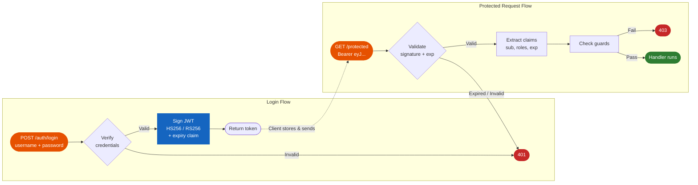

# JWT Authentication

Cello provides JWT (JSON Web Token) authentication middleware implemented in Rust using the `jsonwebtoken` crate. Token validation, signature verification, and claims extraction all happen in Rust with constant-time comparison.



## Quick Start

```python
from cello import App, JwtConfig
from cello.middleware import JwtAuth

app = App()

jwt_config = JwtConfig(
    secret=b"your-secret-key-minimum-32-bytes-long",
    algorithm="HS256",
    expiration=3600  # Token valid for 1 hour
)

app.use(JwtAuth(jwt_config))

@app.get("/protected")
def protected(request):
    claims = request.context.get("jwt_claims")
    return {"user_id": claims["sub"]}
```

---

## JwtConfig

| Parameter | Type | Default | Description |
|-----------|------|---------|-------------|
| `secret` | `bytes` | required | Signing secret (minimum 32 bytes for HS256) |
| `algorithm` | `str` | `"HS256"` | Signing algorithm |
| `expiration` | `int` | `3600` | Token lifetime in seconds |

### Supported Algorithms

| Algorithm | Type | Description |
|-----------|------|-------------|
| `HS256` | HMAC | Symmetric signing with SHA-256 |
| `HS384` | HMAC | Symmetric signing with SHA-384 |
| `HS512` | HMAC | Symmetric signing with SHA-512 |
| `RS256` | RSA | Asymmetric signing with SHA-256 |
| `RS384` | RSA | Asymmetric signing with SHA-384 |
| `RS512` | RSA | Asymmetric signing with SHA-512 |

```python
# HMAC (symmetric) -- same secret for signing and verification
jwt_config = JwtConfig(
    secret=b"your-secret-key-minimum-32-bytes-long",
    algorithm="HS256"
)

# RSA (asymmetric) -- public key for verification
jwt_config = JwtConfig(
    secret=open("public_key.pem", "rb").read(),
    algorithm="RS256"
)
```

---

## Token Creation

Create tokens in your login endpoint:

```python
import jwt  # PyJWT library
import time

SECRET = b"your-secret-key-minimum-32-bytes-long"

@app.post("/login")
def login(request):
    data = request.json()
    username = data.get("username")
    password = data.get("password")

    # Validate credentials against your database
    user = authenticate(username, password)
    if not user:
        return Response.json({"error": "Invalid credentials"}, status=401)

    # Create JWT token
    now = int(time.time())
    payload = {
        "sub": str(user["id"]),        # Subject (user ID)
        "name": user["name"],           # Custom claim
        "roles": user["roles"],          # Custom claim
        "iat": now,                      # Issued at
        "exp": now + 3600               # Expires in 1 hour
    }

    token = jwt.encode(payload, SECRET, algorithm="HS256")
    return {"token": token, "expires_in": 3600}
```

---

## Token Validation

The `JwtAuth` middleware automatically validates tokens on every request:

1. Extracts the token from the `Authorization: Bearer <token>` header.
2. Verifies the signature using the configured secret and algorithm.
3. Checks the `exp` claim for expiration.
4. Stores decoded claims in `request.context["jwt_claims"]`.

```python
@app.get("/profile")
def profile(request):
    claims = request.context.get("jwt_claims")
    return {
        "user_id": claims["sub"],
        "name": claims.get("name"),
        "roles": claims.get("roles", [])
    }
```

---

## Skip Paths

Exclude public endpoints from JWT validation:

```python
jwt_auth = JwtAuth(jwt_config)

# Public paths -- no token required
jwt_auth.skip_path("/login")
jwt_auth.skip_path("/register")
jwt_auth.skip_path("/health")
jwt_auth.skip_path("/docs")
jwt_auth.skip_path("/openapi.json")
jwt_auth.skip_path("/public")

app.use(jwt_auth)
```

!!! warning
    Always skip your login/register endpoints, otherwise clients cannot obtain a token in the first place.

---

## Token Refresh

Implement a refresh endpoint to issue new tokens before the current one expires:

```python
@app.post("/refresh")
def refresh_token(request):
    claims = request.context.get("jwt_claims")
    if not claims:
        return Response.json({"error": "Invalid token"}, status=401)

    # Issue a new token with a fresh expiration
    now = int(time.time())
    new_payload = {
        "sub": claims["sub"],
        "name": claims.get("name"),
        "roles": claims.get("roles", []),
        "iat": now,
        "exp": now + 3600
    }

    new_token = jwt.encode(new_payload, SECRET, algorithm="HS256")
    return {"token": new_token, "expires_in": 3600}
```

---

## Token Blacklisting

Revoke tokens before they expire (e.g., on logout):

```python
# In-memory blacklist (use Redis in production)
blacklisted_tokens = set()

@app.post("/logout")
def logout(request):
    token = request.headers.get("authorization", "").replace("Bearer ", "")
    blacklisted_tokens.add(token)
    return {"logged_out": True}

# Check blacklist in a guard or middleware
@app.get("/protected")
def protected(request):
    token = request.headers.get("authorization", "").replace("Bearer ", "")
    if token in blacklisted_tokens:
        return Response.json({"error": "Token revoked"}, status=401)

    claims = request.context.get("jwt_claims")
    return {"user": claims["sub"]}
```

---

## Standard JWT Claims

| Claim | Description | Example |
|-------|-------------|---------|
| `sub` | Subject (user ID) | `"user_123"` |
| `iat` | Issued at (Unix timestamp) | `1705312800` |
| `exp` | Expiration (Unix timestamp) | `1705316400` |
| `iss` | Issuer | `"myapp.example.com"` |
| `aud` | Audience | `"api.example.com"` |

Custom claims can be added freely:

```python
payload = {
    "sub": "user_123",
    "roles": ["admin", "editor"],
    "permissions": ["read", "write", "delete"],
    "org_id": "org_456",
    "iat": now,
    "exp": now + 3600
}
```

---

## Combining JWT with Guards

Use JWT claims with [Guards](guards.md) for fine-grained authorization:

```python
from cello.guards import Role, Permission

admin_only = Role(["admin"])
can_write = Permission(["write"])

@app.get("/admin/dashboard", guards=[admin_only])
def admin_dashboard(request):
    return {"admin": True}

@app.post("/articles", guards=[can_write])
def create_article(request):
    return {"created": True}
```

---

## Security Best Practices

!!! warning "Secret Management"
    Never hardcode JWT secrets in your source code. Use environment variables or a secret management service.

```python
import os

jwt_config = JwtConfig(
    secret=os.environ["JWT_SECRET"].encode(),
    algorithm="HS256",
    expiration=3600
)
```

- Use a minimum of 32 bytes for HMAC secrets
- Prefer RS256 for public-facing APIs (asymmetric verification)
- Set short expiration times (1 hour or less)
- Implement token refresh rather than long-lived tokens
- Rotate secrets periodically
- Log and monitor failed validations

---

## Next Steps

- [Authentication Overview](authentication.md) - All authentication methods
- [Guards](guards.md) - Role-based access control
- [Sessions](sessions.md) - Cookie-based sessions
- [CSRF](csrf.md) - Cross-Site Request Forgery protection
