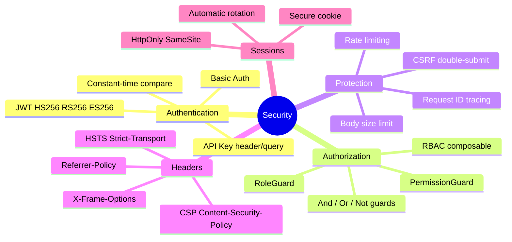
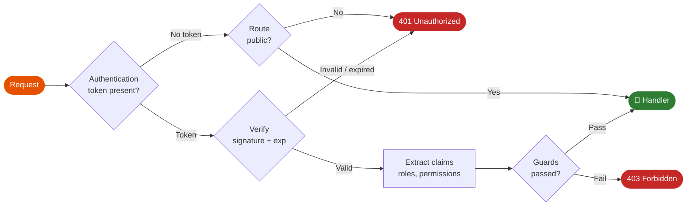

# Security Overview

Cello is built with security as a core principle. All security features are implemented in Rust with constant-time operations to prevent timing attacks.





## Security Features

<div class="grid cards" markdown>

-   :material-key:{ .lg .middle } **Authentication**

    ---

    JWT, Basic Auth, API Key authentication with constant-time validation

    [:octicons-arrow-right-24: Authentication](authentication.md)

-   :material-shield-account:{ .lg .middle } **Authorization (Guards)**

    ---

    Role-based access control with composable guards

    [:octicons-arrow-right-24: Guards](guards.md)

-   :material-key-variant:{ .lg .middle } **JWT**

    ---

    JSON Web Token authentication and validation

    [:octicons-arrow-right-24: JWT](jwt.md)

-   :material-cookie-lock:{ .lg .middle } **Sessions**

    ---

    Secure cookie-based session management

    [:octicons-arrow-right-24: Sessions](sessions.md)

-   :material-shield-lock:{ .lg .middle } **CSRF Protection**

    ---

    Cross-Site Request Forgery protection

    [:octicons-arrow-right-24: CSRF](csrf.md)

-   :material-security:{ .lg .middle } **Security Headers**

    ---

    CSP, HSTS, X-Frame-Options, and more

    [:octicons-arrow-right-24: Headers](headers.md)

</div>

---

## Quick Setup

Enable comprehensive security with a few lines:

```python
from cello import App
from cello.middleware import (
    JwtConfig, JwtAuth,
    SecurityHeadersConfig,
    SessionConfig,
    CsrfConfig
)

app = App()

# Enable security headers (CSP, HSTS, etc.)
app.enable_security_headers()

# Enable CSRF protection
app.enable_csrf()

# Enable rate limiting
app.enable_rate_limit(requests=100, window=60)

# Configure JWT authentication
jwt_config = JwtConfig(
    secret=b"your-secret-key-minimum-32-bytes-long",
    algorithm="HS256",
    expiration=3600  # 1 hour
)
app.use(JwtAuth(jwt_config).skip_path("/public"))
```

---

## Security Principles

### 1. Constant-Time Operations

All security-sensitive comparisons use constant-time algorithms:

```rust
// Rust implementation using subtle crate
use subtle::ConstantTimeEq;

fn verify_token(provided: &[u8], expected: &[u8]) -> bool {
    provided.ct_eq(expected).into()
}
```

This prevents timing attacks where attackers measure response times to guess secrets.

### 2. Defense in Depth

Multiple layers of security:

```
┌─────────────────────────────────────┐
│         Rate Limiting               │
├─────────────────────────────────────┤
│         Security Headers            │
├─────────────────────────────────────┤
│         CSRF Protection             │
├─────────────────────────────────────┤
│         Authentication              │
├─────────────────────────────────────┤
│         Authorization (Guards)      │
├─────────────────────────────────────┤
│         Input Validation            │
├─────────────────────────────────────┤
│         Your Handler                │
└─────────────────────────────────────┘
```

### 3. Secure Defaults

All features use secure defaults:

- Cookies: `HttpOnly`, `Secure`, `SameSite=Lax`
- Sessions: Cryptographically signed
- JWT: Strong algorithms required (HS256, RS256)
- Headers: Modern security headers enabled

---

## Authentication Methods

### JWT Authentication

Best for stateless APIs:

```python
from cello.middleware import JwtConfig, JwtAuth

config = JwtConfig(
    secret=b"your-secret-key-minimum-32-bytes-long",
    algorithm="HS256",
    expiration=3600
)

jwt_auth = JwtAuth(config)
jwt_auth.skip_path("/login")
jwt_auth.skip_path("/public")

app.use(jwt_auth)

@app.get("/protected")
def protected(request):
    claims = request.context.get("jwt_claims")
    return {"user_id": claims["sub"]}
```

### Basic Authentication

For simple use cases:

```python
from cello.middleware import BasicAuth

def verify_credentials(username, password):
    # Your verification logic
    return username == "admin" and password == "secret"

app.use(BasicAuth(verify_credentials))
```

### API Key Authentication

For service-to-service communication:

```python
from cello.middleware import ApiKeyAuth

valid_keys = {"key1": "service-a", "key2": "service-b"}

api_auth = ApiKeyAuth(
    keys=valid_keys,
    header="X-API-Key"
)

app.use(api_auth)
```

---

## Authorization (Guards)

Control access with composable guards:

```python
from cello import RoleGuard, PermissionGuard, And, Or

# Simple role check
admin_only = RoleGuard(["admin"])

# Permission-based
can_edit = PermissionGuard(["posts:edit"])

# Composable guards
admin_or_editor = Or([RoleGuard(["admin"]), RoleGuard(["editor"])])
admin_with_write = And([RoleGuard(["admin"]), PermissionGuard(["write"])])

@app.get("/admin", guards=[admin_only])
def admin_panel(request):
    return {"admin": True}

@app.post("/posts", guards=[can_edit])
def create_post(request):
    return {"created": True}

@app.delete("/posts/{id}", guards=[admin_or_editor])
def delete_post(request):
    return {"deleted": True}
```

---

## Security Headers

Protect against common attacks:

```python
from cello.middleware import SecurityHeadersConfig, CSP

config = SecurityHeadersConfig(
    # Content Security Policy
    csp=CSP(
        default_src=["'self'"],
        script_src=["'self'", "https://cdn.example.com"],
        style_src=["'self'", "'unsafe-inline'"],
        img_src=["'self'", "data:", "https:"],
        connect_src=["'self'", "https://api.example.com"]
    ),

    # HTTP Strict Transport Security
    hsts_max_age=31536000,  # 1 year
    hsts_include_subdomains=True,
    hsts_preload=True,

    # Other headers
    x_frame_options="DENY",
    x_content_type_options="nosniff",
    referrer_policy="strict-origin-when-cross-origin",
    permissions_policy="geolocation=(), microphone=()"
)

app.enable_security_headers(config)
```

---

## Session Security

Secure cookie-based sessions:

```python
from cello.middleware import SessionConfig

config = SessionConfig(
    secret=b"session-secret-minimum-32-bytes-long",
    cookie_name="session_id",
    max_age=86400,  # 24 hours
    http_only=True,
    secure=True,     # HTTPS only
    same_site="Lax"
)

app.enable_sessions(config)

@app.get("/login")
def login(request):
    request.session["user_id"] = "123"
    return {"logged_in": True}

@app.get("/profile")
def profile(request):
    user_id = request.session.get("user_id")
    return {"user_id": user_id}
```

---

## CSRF Protection

Protect against Cross-Site Request Forgery:

```python
from cello.middleware import CsrfConfig

config = CsrfConfig(
    secret=b"csrf-secret-minimum-32-bytes-long",
    cookie_name="_csrf",
    header_name="X-CSRF-Token",
    safe_methods=["GET", "HEAD", "OPTIONS"]
)

app.enable_csrf(config)

# Token available in request
@app.get("/form")
def get_form(request):
    csrf_token = request.csrf_token
    return Response.html(f'''
        <form method="POST">
            <input type="hidden" name="_csrf" value="{csrf_token}">
            <button type="submit">Submit</button>
        </form>
    ''')
```

---

## Rate Limiting

Prevent abuse and DoS attacks:

```python
from cello.middleware import RateLimitConfig

# Basic rate limiting
app.enable_rate_limit(requests=100, window=60)  # 100 req/min

# Advanced configuration
config = RateLimitConfig(
    requests=100,
    window=60,
    algorithm="token_bucket",  # or "sliding_window"
    key_func=lambda req: req.get_header("X-API-Key") or req.client_ip,
    exempt_paths=["/health", "/metrics"]
)

app.enable_rate_limit(config)
```

### Adaptive Rate Limiting

Adjust limits based on server load:

```python
from cello.middleware import AdaptiveRateLimitConfig

config = AdaptiveRateLimitConfig(
    base_requests=100,
    window=60,
    cpu_threshold=0.8,      # Reduce limits above 80% CPU
    memory_threshold=0.9,   # Reduce limits above 90% memory
    latency_threshold=100   # ms - reduce if latency exceeds
)

app.enable_rate_limit(config)
```

---

## Security Checklist

### Development

- [ ] Use environment variables for secrets
- [ ] Enable all security headers
- [ ] Implement proper error handling (don't leak info)
- [ ] Validate all input
- [ ] Use parameterized queries

### Production

- [ ] Use HTTPS everywhere
- [ ] Set `Secure` flag on cookies
- [ ] Enable HSTS with preload
- [ ] Configure CSP properly
- [ ] Set up rate limiting
- [ ] Enable request logging
- [ ] Monitor for anomalies

### API Security

- [ ] Authenticate all endpoints
- [ ] Implement proper authorization
- [ ] Use short-lived tokens
- [ ] Implement token refresh
- [ ] Log authentication failures
- [ ] Rate limit authentication attempts

---

## Common Vulnerabilities Protected

| Vulnerability | Protection | Feature |
|--------------|------------|---------|
| **XSS** | CSP, auto-escaping | Security Headers |
| **CSRF** | Double-submit cookies | CSRF Middleware |
| **SQL Injection** | Parameterized queries | Validation |
| **Clickjacking** | X-Frame-Options | Security Headers |
| **MIME Sniffing** | X-Content-Type-Options | Security Headers |
| **Timing Attacks** | Constant-time comparison | Auth Middleware |
| **DoS** | Rate limiting | Rate Limit Middleware |
| **Session Hijacking** | Secure cookies | Session Middleware |

---

## Next Steps

- [Authentication](authentication.md) - Detailed auth configuration
- [Guards](guards.md) - Advanced authorization
- [JWT](jwt.md) - JWT configuration and best practices
- [Security Headers](headers.md) - Header configuration
