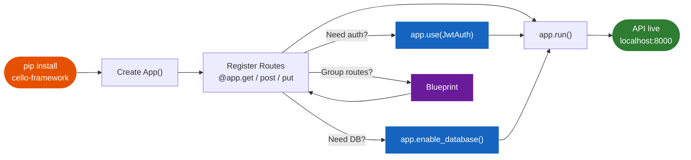

# :material-rocket-launch: Getting Started

<div class="grid" markdown>

!!! tip ""

    **Welcome to Cello!** An ultra-fast Python web framework, powered by Rust. You'll go from zero to a running API in under 5 minutes. Let's build something incredible.

</div>

---

## :material-eye: What You'll Build



By the end of this guide, you'll have a fully functional REST API running at blazing speed:

```python title="app.py"
from cello import App, Response

app = App()

@app.get("/")
def hello(request):
    return {"message": "Hello, World!", "framework": "Cello"}

@app.get("/users/{id}")
def get_user(request):
    user_id = request.params["id"]
    return {"id": user_id, "name": "Jane Doe", "active": True}

@app.post("/users")
def create_user(request):
    data = request.json()
    return Response.json({"created": True, **data}, status=201)

if __name__ == "__main__":
    app.run()
```

```bash title="Terminal output"
$ python app.py
  ___ ___| | | ___
 / __/ _ \ | |/ _ \   Cello v1.3.0
| (_|  __/ | | (_) |  Rust-powered Python Web Framework
 \___\___|_|_|\___/

Cello running at http://127.0.0.1:8000
```

---

## :material-clipboard-check: Prerequisites

!!! info "Before you begin"

    Make sure you have the following installed on your system:

    | Requirement | Version | Check Command |
    |:------------|:--------|:--------------|
    | :material-language-python: **Python** | 3.12+ | `python --version` |
    | :material-package-variant: **pip** | Latest | `pip --version` |
    | :material-cog: **Rust toolchain** | Latest *(source builds only)* | `rustc --version` |

    !!! warning "Python 3.12 Required"

        Cello uses PyO3 with the `abi3-py312` flag. Python 3.11 and earlier are **not** supported.

---

## :material-list-status: Setup in 4 Steps

<div class="grid cards" markdown>

-   :material-numeric-1-circle:{ .lg .middle } **Install Cello**

    ---

    Install the framework with a single command.

    === "pip (Recommended)"

        ```bash
        pip install cello-framework
        ```

    === "From Source"

        ```bash
        git clone https://github.com/jagadeesh32/cello.git
        cd cello && pip install maturin && maturin develop
        ```

-   :material-numeric-2-circle:{ .lg .middle } **Create Your App**

    ---

    Create a new file and initialize Cello.

    ```python title="app.py"
    from cello import App

    app = App()
    ```

-   :material-numeric-3-circle:{ .lg .middle } **Add Routes**

    ---

    Define your endpoints with clean decorators.

    ```python title="app.py"
    @app.get("/")
    def hello(request):
        return {"message": "Hello, World!"}

    @app.get("/users/{id}")
    def get_user(request):
        return {"id": request.params["id"]}
    ```

-   :material-numeric-4-circle:{ .lg .middle } **Run It**

    ---

    Start the server and visit your API.

    ```python title="app.py"
    if __name__ == "__main__":
        app.run()
    ```

    ```bash
    python app.py
    # Visit http://127.0.0.1:8000
    ```

</div>

---

## :material-compass: Quick Navigation

<div class="grid cards" markdown>

-   :material-download:{ .lg .middle } **Installation**

    ---

    Detailed installation instructions for all platforms, including virtual environments and troubleshooting.

    [:octicons-arrow-right-24: Install Guide](installation.md)

-   :material-flash:{ .lg .middle } **Quick Start**

    ---

    A 5-minute walkthrough that covers routes, requests, responses, and your first working API.

    [:octicons-arrow-right-24: Quick Start](quickstart.md)

-   :material-application-braces:{ .lg .middle } **First Application**

    ---

    Build a complete REST API step by step with CRUD operations, error handling, and validation.

    [:octicons-arrow-right-24: First App](first-app.md)

-   :material-folder-cog:{ .lg .middle } **Project Structure**

    ---

    Learn how to organize your Cello project for small scripts, medium apps, and large-scale services.

    [:octicons-arrow-right-24: Structure](project-structure.md)

-   :material-tune-vertical:{ .lg .middle } **Configuration**

    ---

    Configure your application for development, testing, and production environments.

    [:octicons-arrow-right-24: Configuration](configuration.md)

</div>

---

## :material-arrow-right-bold: Next Steps

Once you've built your first app, explore these areas to level up:

<div class="grid cards" markdown>

-   :material-star-shooting:{ .lg .middle } **Explore Features**

    ---

    Discover routing, middleware, security, real-time, and more.

    [:octicons-arrow-right-24: Features](../features/index.md)

-   :material-school:{ .lg .middle } **Learn with Tutorials**

    ---

    Build a REST API, chat app, auth system, and microservices.

    [:octicons-arrow-right-24: Tutorials](../learn/index.md)

-   :material-code-braces:{ .lg .middle } **Browse Examples**

    ---

    Copy-paste examples from basic to enterprise-grade apps.

    [:octicons-arrow-right-24: Examples](../examples/index.md)

</div>

---

!!! tip "Join the Cello Community"

    Have questions? Want to share what you're building? Join the community:

    - :material-discord: **[Discord Server](https://discord.gg/cello)** -- Real-time help and discussion
    - :material-github: **[GitHub Discussions](https://github.com/jagadeesh32/cello/discussions)** -- Feature requests and Q&A
    - :material-stack-overflow: **[Stack Overflow](https://stackoverflow.com/questions/tagged/cello-framework)** -- Tagged questions and answers

    We'd love to hear from you!
