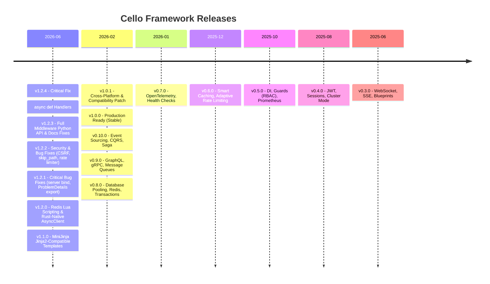

# :material-tag-multiple: Release Notes

---

## :material-new-box: Latest Release — v1.2.4

!!! success "Cello v1.2.4 — Critical Fix: async def Handlers (June 2026)"

    Fixes a critical regression introduced in v1.2.1 where all `async def` route handlers silently returned 500 errors due to `pyo3_asyncio` not being initialised after the server startup change.

    **Highlights:**

    - :material-bug-check: **All `async def` handlers now work** — coroutines are driven via `tokio::task::spawn_blocking + asyncio.run()`
    - :material-test-tube: **New test suite** — `tests/verify_async_client.py` covers all HTTP methods with a local echo server
    - :material-arrow-up: **Drop-in upgrade** from v1.2.3 — no API changes

    [:octicons-arrow-right-24: Full v1.2.4 Release Notes](v1.2.4.md){ .md-button .md-button--primary }
    [:octicons-arrow-right-24: Migration Guide](migration.md){ .md-button }

---

## :material-timeline: Version Timeline



---

## :material-history: All Releases

<div class="grid cards" markdown>

-   :material-bug-check:{ .lg .middle } **v1.2.4** — Critical Async Fix

    ---

    Fixes all `async def` handlers returning 500 since v1.2.1. Coroutines now driven via `spawn_blocking + asyncio.run()`.

    :material-calendar: June 2026

    [:octicons-arrow-right-24: Release Notes](v1.2.4.md)

-   :material-api:{ .lg .middle } **v1.2.3** — Full Middleware Python API

    ---

    `cello.middleware` module, `app.use()` dispatcher, 6 new `enable_*` methods, all doc import paths corrected.

    :material-calendar: June 2026

    [:octicons-arrow-right-24: Release Notes](v1.2.3.md)

-   :material-shield-bug:{ .lg .middle } **v1.2.2** — Security & Bug Fixes

    ---

    Critical CSRF `HttpOnly` fix (broke all AJAX apps), auth `skip_path` prefix bypass fix, rate limiter fixed-window reset bug.

    :material-calendar: June 2026

    [:octicons-arrow-right-24: Release Notes](v1.2.2.md)

-   :material-bug-check:{ .lg .middle } **v1.2.1** — Critical Bug Fixes

    ---

    Server port never bound, `ProblemDetails` missing from Python export, `And`/`Or` guard `*args` style, `HttpOnly` removed from CSRF cookie.

    :material-calendar: June 2026

    [:octicons-arrow-right-24: Release Notes](v1.2.1.md)

-   :material-database-sync:{ .lg .middle } **v1.2.0** — Redis Lua & AsyncClient

    ---

    Redis Lua scripting (`eval`, `evalsha`, `script_load`), Rust-native `AsyncClient` backed by `reqwest + Tokio` — GIL never held during HTTP I/O.

    :material-calendar: June 2026

    [:octicons-arrow-right-24: Release Notes](v1.2.0.md)

-   :material-file-code:{ .lg .middle } **v1.1.0** — MiniJinja Templates

    ---

    Jinja2-compatible template engine via `minijinja` Rust crate. `app.enable_templates()`, `app.render()`, globals, auto HTML-escaping.

    :material-calendar: June 2026

    [:octicons-arrow-right-24: Release Notes](v1.1.0.md)

-   :material-wrench:{ .lg .middle } **v1.0.1** — Cross-Platform & Compatibility Patch

    ---

    Windows multi-worker subprocess mode, ARM JSON fallback, async guard/cache/blueprint compatibility, export completeness.

    :material-calendar: February 2026

    [:octicons-arrow-right-24: Release Notes](v1.0.1.md)

-   :material-check-decagram:{ .lg .middle } **v1.0.0** — Production Ready

    ---

    Stable release with performance optimizations, API stability guarantees, and the complete feature set.

    :material-calendar: February 2026

    [:octicons-arrow-right-24: Release Notes](v1.0.0.md)

-   :material-star-shooting:{ .lg .middle } **v0.10.0** — Advanced Patterns

    ---

    Event Sourcing, CQRS, and the Saga Pattern for distributed transaction coordination.

    :material-calendar: February 2026

    [:octicons-arrow-right-24: Release Notes](v0.10.0.md)

-   :material-api:{ .lg .middle } **v0.9.0** — API Protocols

    ---

    GraphQL support, gRPC integration, and message queue adapters for Kafka and RabbitMQ.

    :material-calendar: February 2026

    [:octicons-arrow-right-24: Release Notes](v0.9.0.md)

-   :material-database:{ .lg .middle } **v0.8.0** — Data Layer

    ---

    Database connection pooling, Redis integration, and transaction support with automatic rollback.

    :material-calendar: February 2026

    [:octicons-arrow-right-24: Release Notes](v0.8.0.md)

-   :material-eye:{ .lg .middle } **v0.7.0** — Enterprise Observability

    ---

    OpenTelemetry distributed tracing, structured health check endpoints, and GraphQL support.

    :material-calendar: January 2026

    [:octicons-arrow-right-24: Release Notes](v0.7.0.md)

-   :material-speedometer:{ .lg .middle } **v0.6.0** — Smart Middleware

    ---

    Intelligent caching with TTL, adaptive rate limiting based on system load, DTO validation, and circuit breaker.

    :material-calendar: December 2025

    [:octicons-arrow-right-24: Release Notes](v0.6.0.md)

-   :material-shield-check:{ .lg .middle } **v0.5.0** — Security & DI

    ---

    Dependency injection, composable RBAC guards, Prometheus metrics, and OpenAPI generation.

    :material-calendar: October 2025

    [:octicons-arrow-right-24: Release Notes](v0.5.0.md)

-   :material-lock:{ .lg .middle } **v0.4.0** — Auth & Sessions

    ---

    JWT authentication, token-bucket rate limiting, secure cookie sessions, security headers, and cluster mode.

    :material-calendar: August 2025

    [:octicons-arrow-right-24: Release Notes](v0.4.0.md)

-   :material-access-point:{ .lg .middle } **v0.3.0** — Real-time

    ---

    WebSocket support, Server-Sent Events, multipart form handling, and Flask-inspired blueprints.

    :material-calendar: June 2025

    [:octicons-arrow-right-24: Release Notes](v0.3.0.md)

</div>

---

## :material-shield-half-full: Support Policy

| Version | Status | Support Until |
|:--------|:-------|:--------------|
| **1.2.x** | :material-check-circle:{ style="color: #4caf50" } **Active** | Current |
| 1.1.x | :material-wrench:{ style="color: #ffab40" } Maintenance | December 2026 |
| 1.0.x | :material-wrench:{ style="color: #ffab40" } Maintenance | October 2026 |
| 0.10.x | :material-shield-alert:{ style="color: #ff9800" } Security Only | August 2026 |
| < 0.10 | :material-close-circle:{ style="color: #f44336" } End of Life | — |

!!! info "Version policy"

    Cello follows [Semantic Versioning](https://semver.org/). Starting with **v1.0.0**, the public API is stable — no breaking changes until v2.0. **Maintenance** releases receive bug fixes. **Security Only** releases receive critical security patches only.

---

## :material-arrow-up-bold-circle: Upgrading

=== "pip"

    ```bash
    # Upgrade to the latest stable release
    pip install --upgrade cello-framework

    # Pin to a specific version
    pip install cello-framework==1.2.4
    ```

=== "requirements.txt"

    ```text
    cello-framework>=1.2.4,<2.0.0
    ```

=== "pyproject.toml"

    ```toml
    [project]
    dependencies = [
        "cello-framework>=1.2.4,<2.0.0",
    ]
    ```

!!! warning "Read the migration guide before upgrading"

    Breaking changes are documented in the [Migration Guide](migration.md). Always review it before bumping a minor version.

---

## :material-file-document-multiple: Additional Resources

<div class="grid cards" markdown>

-   :material-format-list-bulleted:{ .lg .middle } **Full Changelog**

    ---

    Every commit, bug fix, and improvement in one place.

    [:octicons-arrow-right-24: Changelog](changelog.md)

-   :material-directions-fork:{ .lg .middle } **Migration Guide**

    ---

    Step-by-step instructions for upgrading between versions.

    [:octicons-arrow-right-24: Migration Guide](migration.md)

</div>

---

## :material-bell-ring: Stay Updated

- :material-star: [Star the repo on GitHub](https://github.com/jagadeesh32/cello) to show support and get notified
- :material-rss: [Releases RSS Feed](https://github.com/jagadeesh32/cello/releases.atom) for automated notifications
- :fontawesome-brands-discord: [Join Discord](https://discord.gg/cello) for release announcements and discussion
